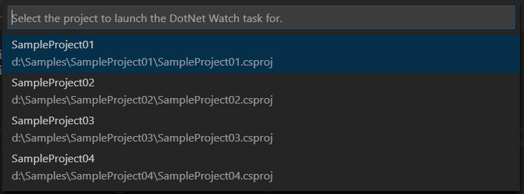

<h1 align="center">
   
    
   
	VS Code - .NET Auto Attach
   
   
</h1>
<h4 align="center">Enables a seamless debugging experience when working with dotnet-watch.</h4>

The ".NET Auto Attach" extension is created to enable a seamless debugging experience when working with dotnet-watch.
While dotnet-watch will rebuild and launch your application every time you change and store a file, you have to manually restart the debugger each time.

This is where ".NET Auto Attach" comes in and shines. After dotnet-watch restarts your application, it will attach the debugger to enable a seamless debugging experience while changing files on the fly.

## Features

### Attach debugger if dotnet-watch reloads

 

### Solutions and Workspaces with multiple projects

 

### Disconnection detection

 

## Requirements

- [C#](https://marketplace.visualstudio.com/items?itemName=ms-vscode.csharp) - C# for Visual Studio Code (powered by OmniSharp).

## Getting Started

1. [Install the extension](https://marketplace.visualstudio.com/items?itemName=dennismaxjung.vscode-dotnet-auto-attach)
2. Restart VS Code and open the folder containing the project you want to work on.

## Using the debugger

When your ".NET: Auto Attach Debug (dotnet-watch)" launch config is set up, you can debug your project. Pick the launch config from the dropdown on the Debug pane in Code. Press the play button or F5 to start.

### Configuration

The extension operates currently only in one mode - it can launch your project you want to debug with dotnet-watch.

Just like when using the normal C# debugger, you configure the mode with a .vscode/launch.json file in the root directory of your project. You can create this file manually, or Code will create one for you if you try to run your project, and it doesn't exist yet.

## Release Notes & Known Issues

See the [CHANGELOG.md](CHANGELOG.md) for the details of changes for each version and known issues.

## Built With

- [typescript-collections](https://www.npmjs.com/package/typescript-collections) - It is a complete, fully tested data structure library written in TypeScript.

## Contributing

Please read [CONTRIBUTING.md](CONTRIBUTING.md) for details on our code of conduct, and the process for submitting pull requests to us.

## Versioning

We use [SemVer](http://semver.org/) for versioning. For the versions available, see the [tags on this repository](https://gitlab.com/dennismaxjung/vscode-dotnet-auto-attach/tags).

## Authors

- **Dennis Jung** - _Initial work_ - [dennismaxjung](https://gitlab.com/dennismaxjung) [dennismaxjung](https://github.com/dennismaxjung)
- **Konrad Müller** - _Initial work_ - [krdmllr](https://github.com/krdmllr)

See also the list of [contributors](https://gitlab.com/dennismaxjung/vscode-dotnet-auto-attach/graphs/master) who participated in this project.
Or the list of [members](https://gitlab.com/dennismaxjung/vscode-dotnet-auto-attach/project_members).

## License

This project is licensed under the MIT License - see the [LICENSE.md](LICENSE) file for details.
